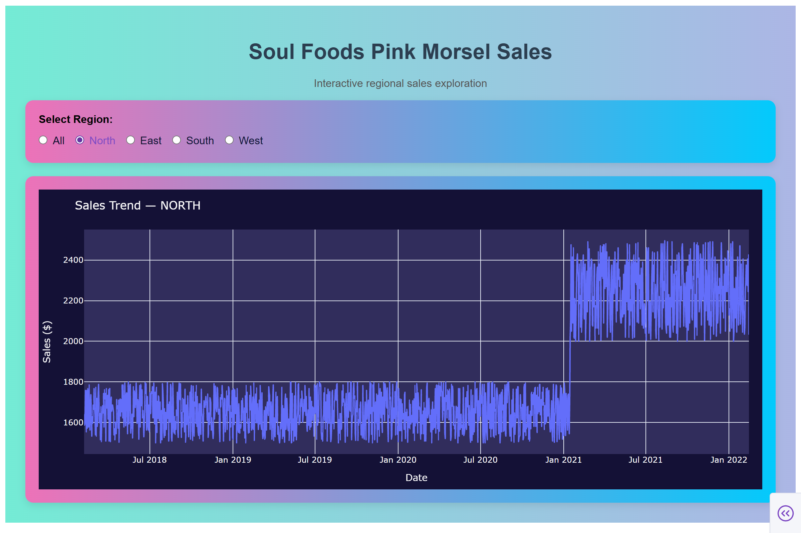

# 📊 Soul Foods Pink Morsel Sales Visualizer

[](https://www.python.org/)
[](https://dash.plotly.com/)
[](https://pandas.pydata.org/)
[](https://docs.pytest.org/)
[](https://github.com/swati048/quantium-starter-repo/actions)
[](https://opensource.org/licenses/MIT)

Interactive data visualization dashboard built with **Python Dash** to explore regional sales trends and answer a business question:

> Were sales higher before or after the Pink Morsel price increase on Jan 15, 2021?

---

## Preview


---

## 🚀 Features

* Data cleaning & transformation with **Pandas**
* Interactive line chart using **Plotly**
* Region filtering via radio buttons
* Styled responsive UI
* Automated UI testing with **Pytest + Dash Testing**

---

## 🛠 Tech Stack

* Python 3.9
* Dash
* Plotly
* Pandas
* Pytest
* Selenium (Dash testing)

---

## 📈 Running the App

### Clone repo

```bash
git clone https://github.com/swati048/quantium-starter-repo.git
cd quantium-starter-repo
```

### Create virtual environment

```bash
python -m venv venv
venv\Scripts\activate
```

### Install dependencies

```bash
pip install -r requirements.txt
```

### Run dashboard

```bash
python app.py
```

Visit:

```
http://127.0.0.1:8050
```

---

## 🧪 Run Tests

```bash
pytest
```

---

## CI Script

```bash
#Run automated tests via:
./run_tests.sh
```

## ⚙️ Continuous Integration (GitHub Actions)

This project uses **GitHub Actions** for automated Continuous Integration.
Every time code is pushed or a pull request is opened against `main`, the workflow defined in:

```
.github/workflows/ci.yml
```

runs automatically to ensure the application remains stable.

### What the CI Pipeline Does

1️⃣ Checks out the repository
2️⃣ Sets up Python 3.9
3️⃣ Installs project dependencies
4️⃣ Installs Chrome for browser-based Dash testing
5️⃣ Installs ChromeDriver automatically
6️⃣ Runs the full Pytest test suite

If all tests pass ✔️ → build succeeds
If any test fails ❌ → build fails immediately

This ensures:

* UI components remain functional
* Dashboard doesn’t break after changes
* Regressions are caught early
* Industry-standard development workflow

---

## 🐛 Troubleshooting

### "selenium.common.exceptions.WebDriverException"
```bash
# This command finds the driver path and adds it to your current session
$env:PATH += ";$(python -c 'from webdriver_manager.chrome import ChromeDriverManager; print(ChromeDriverManager().install())' | Split-Path)"
```

---

## 📊 Business Insight

From the visualization, sales trends before and after the price change can be compared interactively by region, enabling data-driven decision making.

---

## 👩‍💻 Author

**Swati Thakur**
- GitHub: [@swati048](https://github.com/swati048)
- LinkedIn: [Swati Thakur](https://linkedin.com/in/swati048)
- Email: [thakurswati048@gmail.com](mailto:thakurswati048@gmail.com)

---

<div align="center">

**⭐ Star this repository if you found it helpful! ⭐**

Made with ❤️ and 🐍 Python

</div>